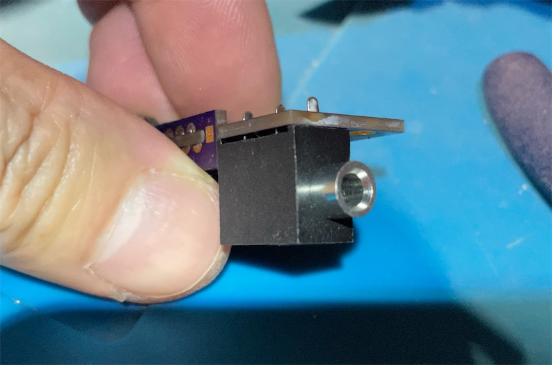

# 8DIN2VGA PCB-Type
-----------
## Parts

- PCB
 - [Main](https://oshpark.com/shared_projects/Ayo7RfDd)
 - [Plug Sub PCB](https://oshpark.com/shared_projects/sRWPes9V)

- 8 pin Mini DIN Male (PCB Type) - Choose the "8 Pin" option - [Link](https://github.com/jeffqchen/JeffParts/blob/main/Connectors/Mini%20DIN/8Pin/Through%20Hole/info.md)

*Note: the "9 Pin" option is incompatible with the Genesis, if you are wondering. Don't buy it.*

- VGA Port Slim Female - [Link](https://github.com/jeffqchen/JeffParts/tree/main/Connectors/VGA%20Slim%20Female%20Through%20Hole/info.md)

- 3.5mm Headphone Jack - [Link](https://github.com/jeffqchen/JeffParts/tree/main/Connectors/Vertical%203.5mm%205-Pin%20Audio%20Jack/info.md)

- (1)M2x20mm and (1)M2x16mm screw and hex nut - [Link](https://github.com/jeffqchen/JeffParts/blob/main/Parts/M2%20M3%20Hex%20Screw%20%26%20Nut/info.md)

- 2x SMD Capacitor 10uF 6.3V 0603 size

- 3D Printed Case and Insert

-----------
## Print

Print the parts in their original orientations, with the mating surface downwards. Print with support.

-----------
## Assembly

Trim all the extra tabs on the PCB and file them flush to ensure an easy assembly.

First, insert the main PCB golden fingers into the plug PCB as indicated in the photos.

Adjust the position to ensure the mating is flush. If not, try filing off some more of the PCB.

 

 

Make sure the main and the plug PCBs are perpendicular. Then tac it down by soldering only one contact. Then inspect again. If something is not right, adjust while keeping your iron on the soldered joint to keep it molten.

Once satisfied, solder down all the contacts between the main and the plug PCB. Then solder on the 0603 10uF capacitors onto the main PCB .

 

Insert the 8 pin DIN plug into the plug PCB. Tac one joint down with solder.

 

 Check if the plug is soldered on straight, adjust if necessary.

 

 

Then solder all the contacts of the plug to the PCB.

Right next to the plug, on the PCB, there is an exposed area of copper. Drown it with copper and solder it to the metal shielding to add more mechanical strength to the assembly.

 

 Don't forget to solder the metal tab on top of the shielding to the PCB for even more strength.

 

 Insert the 3.5mm jack into the PCB. Solder it down by only one lead and adjust it to make sure it's flush to the PCB. Then solder all the contacts.

 

 

Insert the assembly into the inside shell. You might have to push a bit hard if the printing tolerance is tight. Then, fit in the 3D printed insert piece. It should be flush with the outside of the 3.5mm jack.

 
 

Test fit the outside shell and see if the shells close nicely together. If not, check the fitment.

 

Open the shell back up and finally, solder in the VGA port.

Alternatively, you can slide out the entire assembly and solder the VGA port. It's also easier to test in this state.

Remember to put in the insert piece inside when you close up the shell.

If nuts don't want to fit nicely into the shell, twist a screw onto it and use it as a handle and try to press the nut in place from the outside.
