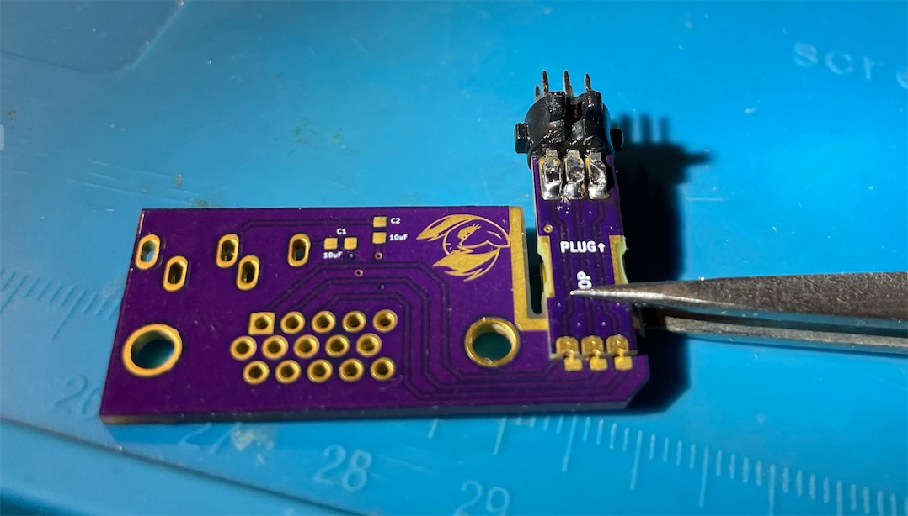
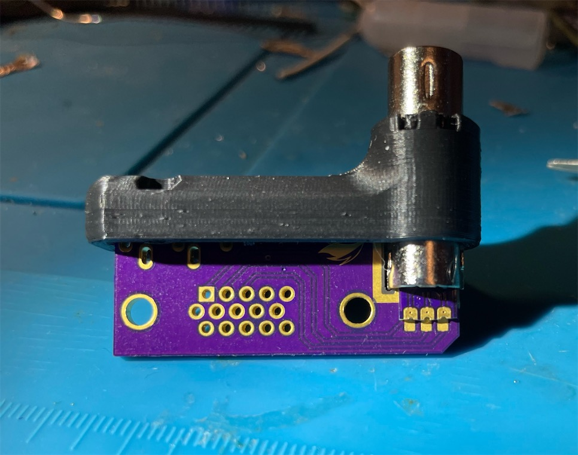
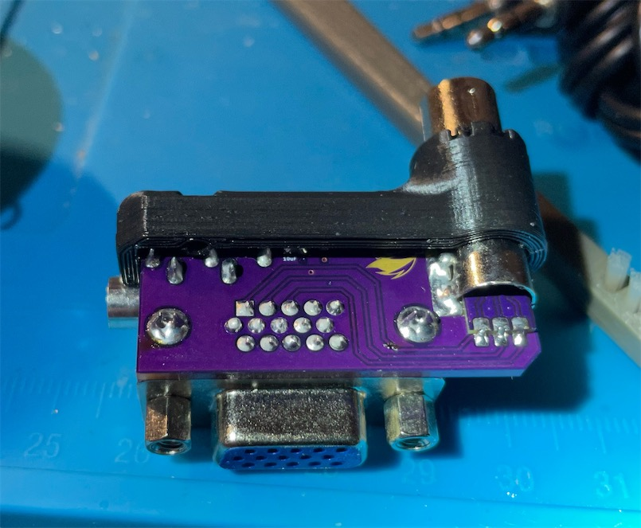

# 8DIN2VGA Plug-Type
-----------

## Parts

- PCB
 - [Main](https://oshpark.com/shared_projects/XZ4A1SB4)
 - [Top Sub (0.8mm)](https://oshpark.com/shared_projects/FF7H08du)
 - [Bottom Sub (0.8mm)](https://oshpark.com/shared_projects/HFqqnMif)

*Note the Top & Bottom sub boards MUST be ordered with the 0.8mm thickness option, otherwise they won't fit!*

- 8 pin Mini DIN Male Plug - [Link](https://github.com/jeffqchen/JeffParts/blob/main/Connectors/Mini%20DIN/8Pin/Cable/info.md)

- VGA Port Slim Female - [Link](https://github.com/jeffqchen/JeffParts/tree/main/Connectors/VGA%20Slim%20Female%20Through%20Hole/info.md)

- 3.5mm Headphone Jack - [Link](https://github.com/jeffqchen/JeffParts/tree/main/Connectors/Vertical%203.5mm%205-Pin%20Audio%20Jack/info.md)

- M2x20mm screw and hex nut - [Link](https://github.com/jeffqchen/JeffParts/blob/main/Parts/M2%20M3%20Hex%20Screw%20%26%20Nut/info.md)

- 2x SMD Capacitor 10uF 6.3V 0603 size

-----------
## Print

Print the parts with the mating surface downwards, with support.

-----------
## Assembly

Soldering in this project is essential and somewhat challenging. This applies to soldering the sub boards to the pin header, as well as the landing pads on the main PCB. If you leave any gap, the assembly will not fit and the shells won't close properlly.

 
 

 First, put the 3 boards together in their final position, and fix the assembly with the help from reverse tweezers or clamps. Try and fit the 0.8mm PCBs in between the gaps between the back side of the 3 rows of pins. Push the sub PCBs all the way until they touch the pin header. Make sure the pins and their pads are aligned properlly.

 ----

 ## IMPORTANT

 *The plastic of the plug pin header is weak against heat and should not be heated for more than a few seconds in one go. Try to cool it down between soldering by blowing air on it.*

 ----

 Solder the two pins on the bottom side of the bottom PCB with proper amount of solder. Then release the clamping and remove the top and main PCB. Proceed to solder the center row of the pins to the bottom PCB.

  

 Again, put everything back together with clamping. Then, solder the top PCB to the top row of the pin header. Now, release the clamping and remove only the main PCB. The assembly should look as follows:

 

 Now, put the 2 pieces of metal shielding over the pin header part:

 

 Shove the assembly through the round hole on the inside shell, all the way in:

 

 Test fit the main PCB firmly into the shell and the plug and see if all the landing pads line up correctly:

 
 

 Now, take out the main PCB and solder on the 10uF SMD caps and the headphone jack:

 

 Again, insert the main PCB into its final position. Pinch the two sub boards into the main with a clapm or reverse tweezers. Make sure there's no gap between the sub and main PCB. Then, solder all the landing pads with proper amount of solder.

 
 

 Then, use ample amount of solder to attach the metal shield of the plug to the exposed copper area onto both sides of the main PCB。

 
 

 Last, solder in the VGA port. Soldering is done.

 
