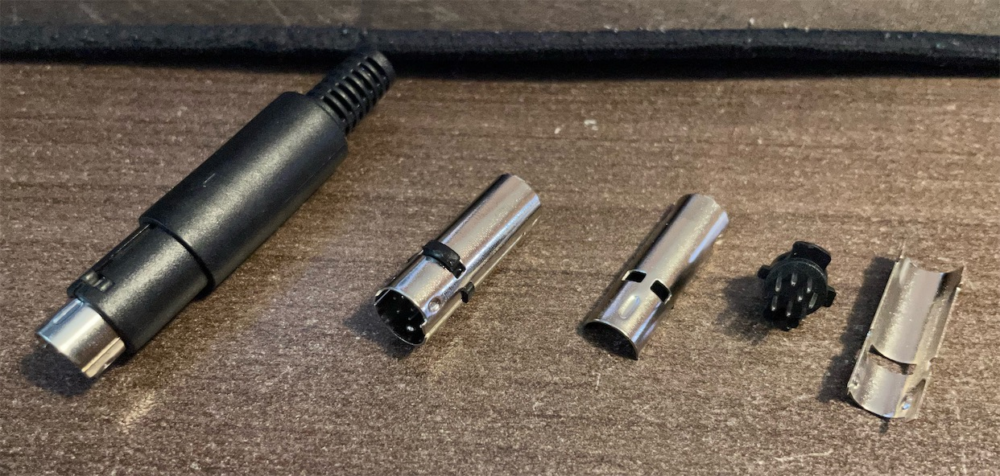
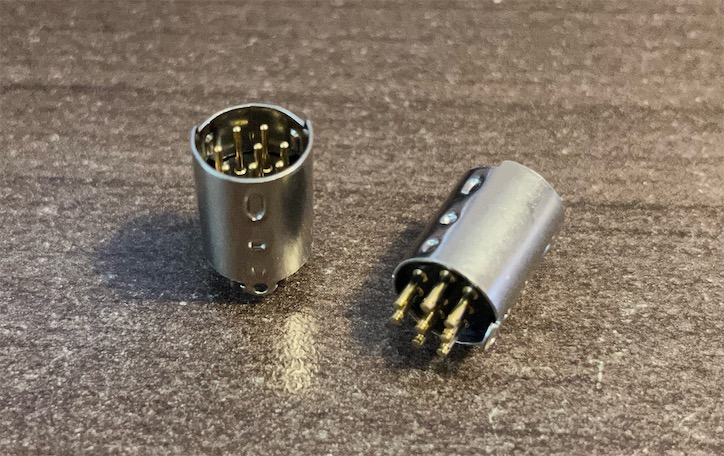

# 8DIN2VGA

 

A dongle for console with 8 pin Mini DIN RGBs video output.

------

This adapter allows you to plug into consoles that outputs RGBs and audio via a 8 pin Mini DIN jack and transmit the signals through a VGA cable. This includes but not limited to:
- NESRGB modded NES/Famicom
- 3DORGB modded with 3DORGB and 8 pin Mini DIN option
- Certain supergun boards

 

 Audio can be sent within the VGA cable, or extracted from the 3.5mm jack on the dongle. Buzzing may be noticeable when audio is transmited through the VGA cable in certain scenes in certain games. This is due to insufficient shielding in most VGA cables. If you find the buzzing to be annoying, please use the 3.5mm jack on the dongle for audio output. This will ensure the cleanest possible audio.

-----------

## Different Designs

There are two types of 8 pin Mini DIN connectors you can purchase. One typically used for building cables, the other that's directly soldered to the PCB. Hence I've made two distinct designs for each of them. Comparatively speaking, the PCB-type design is easier to assemble. Otherwise, they function perfectly the same.

[Building Guide for Plug-Type 8DIN2VGA](./8DIN2VGA/tree/main/8DIN2VGA_Plug)

[Building Guide for PCB-Type 8DIN2VGA](./8DIN2VGA/tree/main/8DIN2VGA_PCB)
